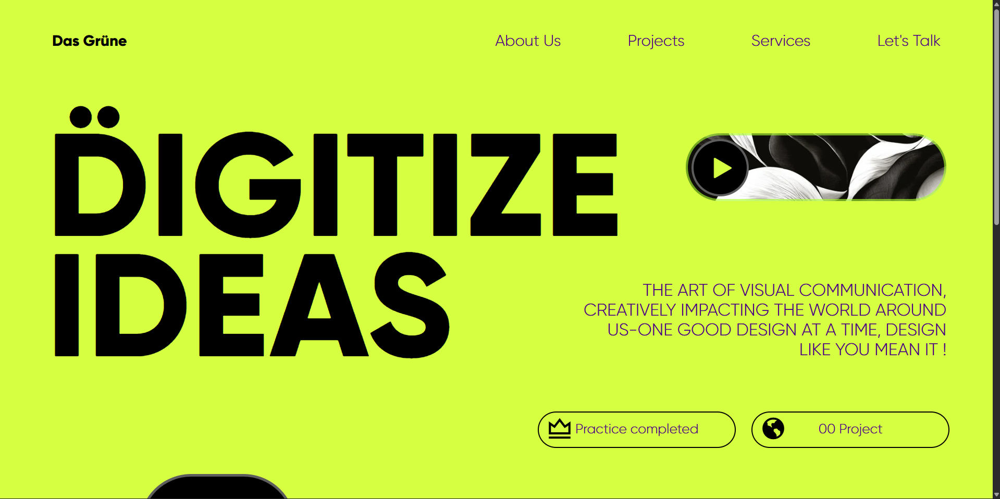
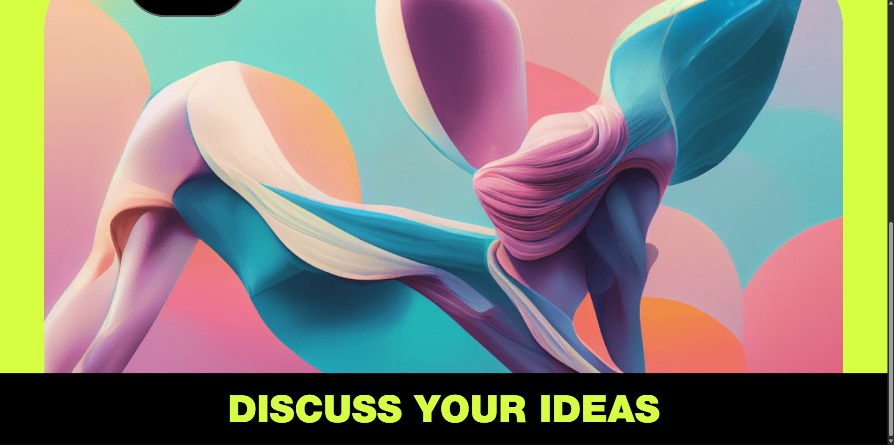

# 🎨 Creative Landing Page

A modern landing page recreated for practice while learning HTML and CSS. This project helped me understand how real-world landing pages are structured and styled.

## 📸 Preview

---

## 🚀 Technologies Used

- HTML5
- CSS3
- Remix Icons
- Custom Fonts

---

## 📚 What I Learned

### HTML

- Semantic HTML structure
- Organizing sections using `<header>`, `<nav>`, `<main>`, and `<footer>`
- Proper use of divs and classes

### CSS

- Flexbox
- Positioning (`relative` & `absolute`)
- Custom fonts using `@font-face`
- Background images
- Border radius
- Typography
- Margins & Padding
- Text alignment
- Custom icons (Remix Icons)

### Other Concepts

- Recreating an existing UI
- Organizing assets into folders
- Debugging layout issues
- Building a complete static webpage

---

## 🎯 Challenges Faced

- Understanding Flexbox alignment
- Positioning elements correctly
- Removing unwanted gaps between headings
- Working with custom fonts

---

## 🎨 Design Inspiration

UI inspired by the **Das Grüne – Creative Design Agency Landing Page** on Dribbble.

Original Design:
https://dribbble.com/shots/19365923-Das-Gr-ne-Creative-Design-Agency-Landing-Page-Website

This project was recreated for learning and practice purposes only.

---

## 📌 Note

This project was built as part of my frontend learning journey to strengthen my HTML and CSS fundamentals.
